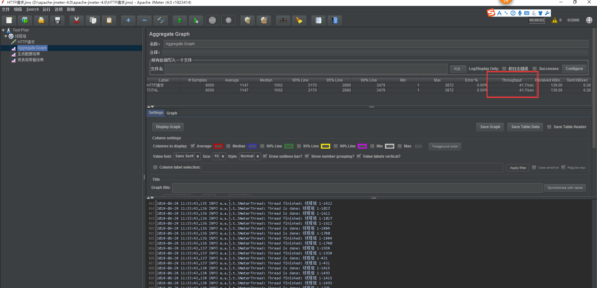

### 一、java内存结构


 

**虚拟机栈**： 每一个方法对应一个栈帧，方法的参数，局部变量都放在栈帧

​                   每一个线程都拥有一个栈空间，在线程中调用一个方法的时候就会启动一个栈帧，没一个栈帧中保存这个方法用到的局部变量。

**堆**：所有new出来的都放在  heap里面

**方法区（永久区）：**   perm开头

​       class文件信息，静态变量，字符串常量，常量池 这类放在 永久区；

**在JVM中共享数据空间划分如下图所示** 


 


1.JVM中共享数据空间可以分成三个大区，新生代（Young Generation）、老年代（Old Generation）、永久代（Permanent Generation），其中JVM堆分为新生代和老年代

2.新生代可以划分为三个区，Eden区（存放新生对象），两个幸存区（From Survivor和To Survivor）（存放每次垃圾回收后存活的对象）

3.永久代管理class文件、静态对象、属性等 

Eden：From Survivor:To Survivor=8:1:1

新生代:老年代=1:3 或者1:2

**回收的过程:**

新建对象在Eden区，进行一次GC后有，有引用的对象复制到Survivor区，没引用的对象被回收。

经过多次GC后，对象没有被回收进入  **老年代**

创建的大对象直接放**老年代**

**引用类型：强、软、弱、虚、**

**如何确定垃圾：**

-   引用计数：

-   正向可达（当前确定垃圾的算法）：

    从roots对象计算可以到达的对象


**垃圾收集算法**：

​     **标记清除**（mark-sweep）:缺点 不连续，内存碎片化

​     **拷贝 coping** （Survivor区使用这个算法） ：把内存分为2部分，A区满后拷贝到B区，B区满后存活对象拷贝A区，缺点：服务器内存浪费； 

​     **标记压缩(**mark-compact老年代使用这个算法)：按顺序拷贝存放，可用和不可用的内存

### 二、JVM参数

**- **       标准参数，所有jVM都应该支持

-X      非标准，每个jvm实现都不同

-XX   不稳定参数，下一个版本可能会取消

bjmashibing(马士兵微信)

### 三、java对象的分配

- 栈上分配

  - 线程私有小对象
  - 无逃逸
  - 支持标量替换
  - 无需调整

- 线程本地分配TLAB(Thread Locla Allacation Buffer )
   -  占用eden去， 每个线程默认分配1%(每个线程都有一个线程本地空间，)
   -  多线程的时候不用竞争eden就可以申请空间，提高效率
   -  小对象
   -  无需调整
-  老年代
   -  大对象

  

### JVM参数说明

```java
-XX:-UseTLABTLAB Thread  Local Allocation Buffer  //关闭线程本地缓存区   （线程本地缓存区在eden区）
  
-XX:-DoEscapeAnalysis 关闭逃逸分析 

-XX:-EliminateAllocations  不做标量 分配

-XX:+PrintGCDetails   打印GC详情

-XX:+PrintGC

-Xss128   //线程大小值，值越大启动的线程越多，


idea JVM参数设置  (+EliminateAllocations)  加号代表开启
-server  -XX:-DoEscapeAnalysis   -XX:-EliminateAllocations -XX:+UseTLAB -XX:+PrintGC 

-XX:HeapDumpPath     //堆内存信息输出地址，
-Xms分配堆最小内存，  //默认为物理内存的1/64；
-Xmx分配最大内存，    //默认为物理内存的1/4。

-server -XX:+HeapDumpOnOutOfMemoryError -XX:HeapDumpPath=c:\jvm.dump -XX:+PrintGCDetails -Xms10m -Xmx10m

堆设置
   -Xms   ://初始堆大小
   -Xmx     //最大堆大小
   -Xss    //线程栈大小
   -XX:NewSize   //设置年轻代大小
   -XX:NewRatio  //-XX:NewRatio=4表示年轻代与年老代所占比值为1:4,年轻代占整个堆栈的1/5
                 //Xms=Xmx并且设置了Xmn的情况下，该参数不需要进行设置。
   -XX:SurvivorRatio  //设置为8,则两个Survivor区与一个Eden区的比值为2:8,一个Survivor区占整个年轻代的1/10
   -XX:MaxPermSize


```


~~~java
Heap
 PSYoungGen      total 213760K, used 46802K [0x2f2c0000, 0x3dc00000, 0x3dc00000)  //新生代
  eden space 212736K, 21% used [0x2f2c0000,0x32070a70,0x3c280000)
  from space 1024K, 1% used [0x3c280000,0x3c284000,0x3c380000)
  to   space 1024K, 0% used [0x3db00000,0x3db00000,0x3dc00000)
 ParOldGen       total 43776K, used 574K [0x12000000, 0x14ac0000, 0x2f2c0000)  //老年代
  object space 43776K, 1% used [0x12000000,0x1208f970,0x14ac0000)
 Metaspace       used 1895K, capacity 2244K, committed 2368K, reserved 4480K //永久区
~~~

**JVM参数的含义** 实例见[实例分析](http://www.cnblogs.com/redcreen/archive/2011/05/05/2038331.html) 

| **参数名称**                | **含义**                                                   | **默认值**           |                                                              |
| --------------------------- | ---------------------------------------------------------- | -------------------- | ------------------------------------------------------------ |
| -Xms                        | 初始堆大小                                                 | 物理内存的1/64(<1GB) | 默认(MinHeapFreeRatio参数可以调整)空余堆内存小于40%时，JVM就会增大堆直到-Xmx的最大限制. |
| -Xmx                        | 最大堆大小                                                 | 物理内存的1/4(<1GB)  | 默认(MaxHeapFreeRatio参数可以调整)空余堆内存大于70%时，JVM会减少堆直到 -Xms的最小限制 |
| -Xmn                        | 年轻代大小(1.4or lator)                                    |                      | **注意**：此处的大小是（eden+ 2 survivor space).与jmap -heap中显示的New gen是不同的。 整个堆大小=年轻代大小 + 年老代大小 + 持久代大小. 增大年轻代后,将会减小年老代大小.此值对系统性能影响较大,Sun官方推荐配置为整个堆的3/8 |
| -XX:NewSize                 | 设置年轻代大小(for 1.3/1.4)                                |                      |                                                              |
| -XX:MaxNewSize              | 年轻代最大值(for 1.3/1.4)                                  |                      |                                                              |
| -XX:PermSize                | 设置持久代(perm gen)初始值                                 | 物理内存的1/64       |                                                              |
| -XX:MaxPermSize             | 设置持久代最大值                                           | 物理内存的1/4        |                                                              |
| -Xss                        | 每个线程的堆栈大小                                         |                      | JDK5.0以后每个线程堆栈大小为1M,以前每个线程堆栈大小为256K.更具应用的线程所需内存大小进行 调整.在相同物理内存下,减小这个值能生成更多的线程.但是操作系统对一个进程内的线程数还是有限制的,不能无限生成,经验值在3000~5000左右 一般小的应用， 如果栈不是很深， 应该是128k够用的 大的应用建议使用256k。这个选项对性能影响比较大，需要严格的测试。（校长） 和threadstacksize选项解释很类似,官方文档似乎没有解释,在论坛中有这样一句话:"” -Xss is translated in a VM flag named ThreadStackSize” 一般设置这个值就可以了。 |
| -*XX:ThreadStackSize*       | Thread Stack Size                                          |                      | (0 means use default stack size) [Sparc: 512; Solaris x86: 320 (was 256 prior in 5.0 and earlier); Sparc 64 bit: 1024; Linux amd64: 1024 (was 0 in 5.0 and earlier); all others 0.] |
| -XX:NewRatio                | 年轻代(包括Eden和两个Survivor区)与年老代的比值(除去持久代) |                      | -XX:NewRatio=4表示年轻代与年老代所占比值为1:4,年轻代占整个堆栈的1/5 Xms=Xmx并且设置了Xmn的情况下，该参数不需要进行设置。 |
| -XX:SurvivorRatio           | Eden区与Survivor区的大小比值                               |                      | 设置为8,则两个Survivor区与一个Eden区的比值为2:8,一个Survivor区占整个年轻代的1/10 |
| -XX:LargePageSizeInBytes    | 内存页的大小不可设置过大， 会影响Perm的大小                |                      | =128m                                                        |
| -XX:+UseFastAccessorMethods | 原始类型的快速优化                                         |                      |                                                              |
| -XX:+DisableExplicitGC      | 关闭System.gc()                                            |                      | 这个参数需要严格的测试                                       |
| -XX:MaxTenuringThreshold    | 垃圾最大年龄                                               |                      | 如果设置为0的话,则年轻代对象不经过Survivor区,直接进入年老代. 对于年老代比较多的应用,可以提高效率.如果将此值设置为一个较大值,则年轻代对象会在Survivor区进行多次复制,这样可以增加对象再年轻代的存活 时间,增加在年轻代即被回收的概率 该参数只有在串行GC时才有效. |
| -XX:+AggressiveOpts         | 加快编译                                                   |                      |                                                              |
| -XX:+UseBiasedLocking       | 锁机制的性能改善                                           |                      |                                                              |
| -Xnoclassgc                 | 禁用垃圾回收                                               |                      |                                                              |
| -XX:SoftRefLRUPolicyMSPerMB | 每兆堆空闲空间中SoftReference的存活时间                    | 1s                   | softly reachable objects will remain alive for some amount of time after the last time they were referenced. The default value is one second of lifetime per free megabyte in the heap |
| -XX:PretenureSizeThreshold  | 对象超过多大是直接在旧生代分配                             | 0                    | 单位字节 新生代采用Parallel Scavenge GC时无效 另一种直接在旧生代分配的情况是大的数组对象,且数组中无外部引用对象. |
| -XX:TLABWasteTargetPercent  | TLAB占eden区的百分比                                       | 1%                   |                                                              |
| -XX:+*CollectGen0First*     | FullGC时是否先YGC                                          | false                |                                                              |

**并行收集器相关参数**

| -XX:+UseParallelGC          | Full GC采用parallel MSC (此项待验证)              |      | 选择垃圾收集器为并行收集器.此配置仅对年轻代有效.即上述配置下,年轻代使用并发收集,而年老代仍旧使用串行收集.(此项待验证) |
| --------------------------- | ------------------------------------------------- | ---- | ------------------------------------------------------------ |
| -XX:+UseParNewGC            | 设置年轻代为并行收集                              |      | 可与CMS收集同时使用 JDK5.0以上,JVM会根据系统配置自行设置,所以无需再设置此值 |
| -XX:ParallelGCThreads       | 并行收集器的线程数                                |      | 此值最好配置与处理器数目相等 同样适用于CMS                   |
| -XX:+UseParallelOldGC       | 年老代垃圾收集方式为并行收集(Parallel Compacting) |      | 这个是JAVA 6出现的参数选项                                   |
| -XX:MaxGCPauseMillis        | 每次年轻代垃圾回收的最长时间(最大暂停时间)        |      | 如果无法满足此时间,JVM会自动调整年轻代大小,以满足此值.       |
| -XX:+UseAdaptiveSizePolicy  | 自动选择年轻代区大小和相应的Survivor区比例        |      | 设置此选项后,并行收集器会自动选择年轻代区大小和相应的Survivor区比例,以达到目标系统规定的最低相应时间或者收集频率等,此值建议使用并行收集器时,一直打开. |
| -XX:GCTimeRatio             | 设置垃圾回收时间占程序运行时间的百分比            |      | 公式为1/(1+n)                                                |
| -XX:+*ScavengeBeforeFullGC* | Full GC前调用YGC                                  | true | Do young generation GC prior to a full GC. (Introduced in 1.4.1.) |

**CMS相关参数**

| -XX:+UseConcMarkSweepGC                | 使用CMS内存收集                           |      | 测试中配置这个以后,-XX:NewRatio=4的配置失效了,原因不明.所以,此时年轻代大小最好用-Xmn设置.??? |
| -------------------------------------- | ----------------------------------------- | ---- | ------------------------------------------------------------ |
| -XX:+AggressiveHeap                    |                                           |      | 试图是使用大量的物理内存 长时间大内存使用的优化，能检查计算资源（内存， 处理器数量） 至少需要256MB内存 大量的CPU／内存， （在1.4.1在4CPU的机器上已经显示有提升） |
| -XX:CMSFullGCsBeforeCompaction         | 多少次后进行内存压缩                      |      | 由于并发收集器不对内存空间进行压缩,整理,所以运行一段时间以后会产生"碎片",使得运行效率降低.此值设置运行多少次GC以后对内存空间进行压缩,整理. |
| -XX:+CMSParallelRemarkEnabled          | 降低标记停顿                              |      |                                                              |
| -XX+UseCMSCompactAtFullCollection      | 在FULL GC的时候， 对年老代的压缩          |      | CMS是不会移动内存的， 因此， 这个非常容易产生碎片， 导致内存不够用， 因此， 内存的压缩这个时候就会被启用。 增加这个参数是个好习惯。 可能会影响性能,但是可以消除碎片 |
| -XX:+UseCMSInitiatingOccupancyOnly     | 使用手动定义初始化定义开始CMS收集         |      | 禁止hostspot自行触发CMS GC                                   |
| -XX:CMSInitiatingOccupancyFraction=70  | 使用cms作为垃圾回收 使用70％后开始CMS收集 | 92   | 为了保证不出现promotion failed(见下面介绍)错误,该值的设置需要满足以下公式**CMSInitiatingOccupancyFraction计算公式** |
| -XX:CMSInitiatingPermOccupancyFraction | 设置Perm Gen使用到达多少比率时触发        | 92   |                                                              |
| -XX:+CMSIncrementalMode                | 设置为增量模式                            |      | 用于单CPU情况                                                |
| -XX:+CMSClassUnloadingEnabled          |                                           |      |                                                              |

**辅助信息**

| -XX:+PrintGC                          |                                                          |      | 输出形式:[GC 118250K->113543K(130112K), 0.0094143 secs] [Full GC 121376K->10414K(130112K), 0.0650971 secs] |
| ------------------------------------- | -------------------------------------------------------- | ---- | ------------------------------------------------------------ |
| -XX:+PrintGCDetails                   |                                                          |      | 输出形式:[GC [DefNew: 8614K->781K(9088K), 0.0123035 secs] 118250K->113543K(130112K), 0.0124633 secs] [GC [DefNew: 8614K->8614K(9088K), 0.0000665 secs][Tenured: 112761K->10414K(121024K), 0.0433488 secs] 121376K->10414K(130112K), 0.0436268 secs] |
| -XX:+PrintGCTimeStamps                |                                                          |      |                                                              |
| -XX:+PrintGC:PrintGCTimeStamps        |                                                          |      | 可与-XX:+PrintGC -XX:+PrintGCDetails混合使用 输出形式:11.851: [GC 98328K->93620K(130112K), 0.0082960 secs] |
| -XX:+PrintGCApplicationStoppedTime    | 打印垃圾回收期间程序暂停的时间.可与上面混合使用          |      | 输出形式:Total time for which application threads were stopped: 0.0468229 seconds |
| -XX:+PrintGCApplicationConcurrentTime | 打印每次垃圾回收前,程序未中断的执行时间.可与上面混合使用 |      | 输出形式:Application time: 0.5291524 seconds                 |
| -XX:+PrintHeapAtGC                    | 打印GC前后的详细堆栈信息                                 |      |                                                              |
| -Xloggc:filename                      | 把相关日志信息记录到文件以便分析. 与上面几个配合使用     |      |                                                              |
| -XX:+PrintClassHistogram              | garbage collects before printing the histogram.          |      |                                                              |
| -XX:+PrintTLAB                        | 查看TLAB空间的使用情况                                   |      |                                                              |
| XX:+PrintTenuringDistribution         | 查看每次minor GC后新的存活周期的阈值                     |      | Desired survivor size 1048576 bytes, new threshold 7 (max 15) new threshold 7即标识新的存活周期的阈值为7。 |

典型tomcat优化配置


```java
set JAVA_OPTS=
    

   -Xms4g     //设置tomcat起始内存为4g

   -Xmx4g    // 最大内存
    
   -XX:+AggressiveOpts
    
   -XX:+UseBiasedLocking  //锁机制的性能改善
 
   -XX:PermSize   //jdk1.8 以后没有了，永久区大小，类太多话最多给300m
   
   -XX:MaxPermSize： //Perm（俗称方法区）占整个堆内存的最大值，也称内存最大永久保留区域。
   
   -XX:+DisableExplicitGc   //关闭程序System.gc()
   
   ---设置GC
   -XX:+UseConcMarkSweepGC   // 使用CMS缩短响应时间，并发收集，低停顿
   -XX:+UseParNewGC   //并行收集新生代的垃圾
   
   
   -XX:LargepageSizeInBytes=128m    //内存分页大小对性能的提升
   -XX:+UseFastAccessorMethods   //get/set 方法转成本地代码，提高效率
   
   
   
```

  每秒41.7的请求

在tomcat   catalina.bat 文件中设置，虚拟机参数， -Xms4g -Xmx4g -Xss1024k   调整后看Throughput看线程并发数

set JAVA_OPTS=-Xms4g -Xmx4g -Xss1024k  -XX:+AggressiveOpts -XX:+UseBiasedLocking -XX:PermSize=64m -XX:MaxPermSize=300m -XX:+DisableExplicitGC -XX:+UseConcMarkSweepGC -XX:+UseParNewGC
-XX:+CMSParallelRemarkEnabled -XX:+UseCMSCompactAtFullCollection  -XX:LargepageSizeInBytes=128m -XX:+UseFastAccessorMethods 