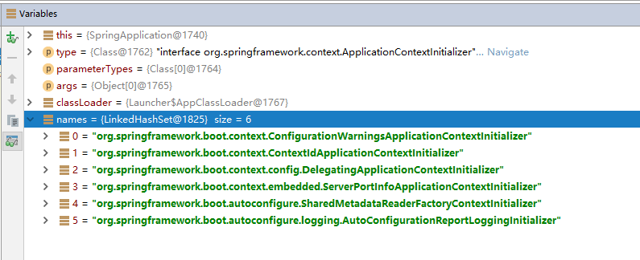
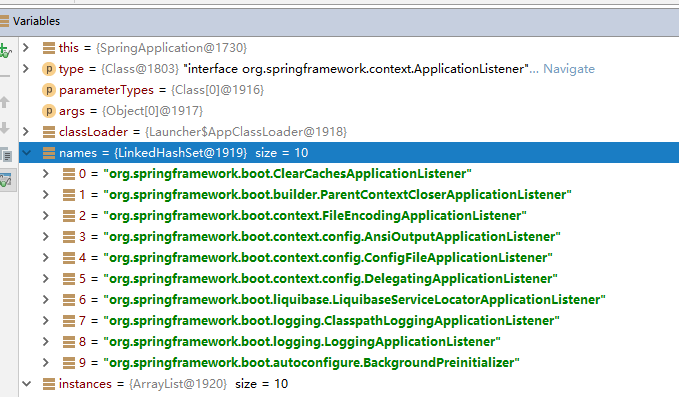
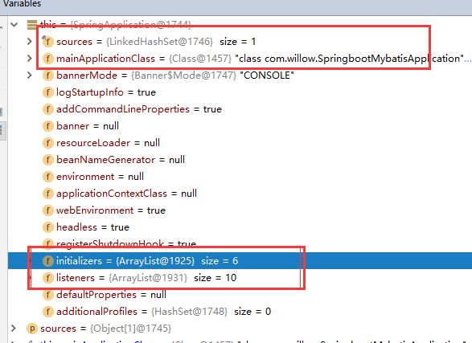

# 一、启动配置原理

几个重要的事件回调机制

配置在META-INF/spring.factories

**ApplicationContextInitializer**

**SpringApplicationRunListener**


只需要放在ioc容器中

**ApplicationRunner**

**CommandLineRunner**


启动流程：断点启动Spring boot应用

#####1、下一步进入SpringApplication.run()中，此方法分为2个步骤

~~~java
public static ConfigurableApplicationContext run(Object[] sources, String[] args) {
		return new SpringApplication(sources).run(args);  //sources为主运行类的信息
}
第一步：创建SpringApplication对象
第二步：运行run();
~~~

# 1.1  第一步SpringApplication创建

初始化参数，执行SpringApplication()方法

~~~java
public SpringApplication(Object... sources) {
		initialize(sources);
}
~~~

## 1.1.1 执行SpringApplication.initialize（）

~~~java
private void initialize(Object[] sources) {
		if (sources != null && sources.length > 0) {
			this.sources.addAll(Arrays.asList(sources));//保存主配置类
		}
    //判断是否为web应用，通过classLoader判断是否加载的有{ "javax.servlet.Servlet",
			"org.springframework.web.context.ConfigurableWebApplicationContext" }
		this.webEnvironment = deduceWebEnvironment();
    //从类路径下找到META-INF/spring.factories配置的所有ApplicationContextInitializer；然后保存起来
		setInitializers((Collection) getSpringFactoriesInstances(
				ApplicationContextInitializer.class));
    //从类路径下找到ETA-INF/spring.factories配置的所有ApplicationListener
		setListeners((Collection) getSpringFactoriesInstances(ApplicationListener.class));
		this.mainApplicationClass = deduceMainApplicationClass();//获取到main方法所在的类
}
~~~

#### 1.1.1.1   创建ApplicationContextInitializer 

getSpringFactoriesInstances（）说明： loadFactoryNames()获取需要加载的类

~~~java
private <T> Collection<? extends T> getSpringFactoriesInstances(Class<T> type,
			Class<?>[] parameterTypes, Object... args) {
		ClassLoader classLoader = Thread.currentThread().getContextClassLoader();
		// 通过classLoader 从类路径下找到META-INF/spring.factories配置的所有ApplicationContextInitializer集合，
		Set<String> names = new LinkedHashSet<String>(
				SpringFactoriesLoader.loadFactoryNames(type, classLoader));
		List<T> instances = createSpringFactoriesInstances(type, parameterTypes,
				classLoader, args, names);  //创建实例
		AnnotationAwareOrderComparator.sort(instances); //排序
		return instances;
}
~~~


##### 1.1.1.1.1 执行 SpringFactoriesLoader.loadFactoryNames（）

说明：主要执行SpringFactoriesLoader.loadFactoryNames(type, classLoader)，通过classLoader 从类路径下找到META-INF/spring.factories配置的所有ApplicationContextInitializer

~~~java
//获取ApplicationContextInitializer 保存起来
public static List<String> loadFactoryNames(Class<?> factoryClass, ClassLoader classLoader) {
		String factoryClassName = factoryClass.getName();
		try {
            //获取所有jar下面的META-INF/spring.factories 文件路径
           //例如： jar:file:/C:/Users/Administrator/.m2/repository/org/springframework/boot/spring-boot/1.5.10.RELEASE/spring-boot-1.5.10.RELEASE.jar!/META-INF/spring.factories
			Enumeration<URL> urls = (classLoader != null ? classLoader.getResources(FACTORIES_RESOURCE_LOCATION) :
					ClassLoader.getSystemResources(FACTORIES_RESOURCE_LOCATION));
			List<String> result = new ArrayList<String>();
			while (urls.hasMoreElements()) {
				URL url = urls.nextElement();
				Properties properties = PropertiesLoaderUtils.loadProperties(new UrlResource(url));
                //读取配置文件中的ApplicationContextInitializer
				String factoryClassNames = properties.getProperty(factoryClassName);
				result.addAll(Arrays.asList(StringUtils.commaDelimitedListToStringArray(factoryClassNames)));
			}
			return result;
		}
		catch (IOException ex) {
			throw new IllegalArgumentException("Unable to load [" + factoryClass.getName() +
					"] factories from location [" + FACTORIES_RESOURCE_LOCATION + "]", ex);
		}
	}
~~~

获取的ApplicationContextInitializer




#### 1.1.1.2   创建ApplicationListener

​            执行setListeners((Collection) getSpringFactoriesInstances(ApplicationListener.class)); 和ApplicationContextInitializer操作一样；

 从类路径下找到ETA-INF/spring.factories配置的所有ApplicationListener

 获取的ApplicationListener 如下：



#### 1.1.1.3  获取配置类main()

从多个配置类中哪个类中有main（）的主配置类

```
this.mainApplicationClass = deduceMainApplicationClass();
```

~~~java
private Class<?> deduceMainApplicationClass() {
		try {
			StackTraceElement[] stackTrace = new RuntimeException().getStackTrace();
			for (StackTraceElement stackTraceElement : stackTrace) {
				if ("main".equals(stackTraceElement.getMethodName())) {  //判断是否包含main方法
					return Class.forName(stackTraceElement.getClassName());
				}
			}
		}
		catch (ClassNotFoundException ex) {
			// Swallow and continue
		}
		return null;
	}
~~~

1.1.1.4 初始化结束

画圈为initialize（）方法执行保存结果，和webEnvironment

 

QQ截图20180607145300.png

# 1.2  SpringApplication.run()方法

~~~java
public ConfigurableApplicationContext run(String... args) {
		StopWatch stopWatch = new StopWatch(); //开始起止的监听
		stopWatch.start();
		ConfigurableApplicationContext context = null;   //声明IOC容器
		FailureAnalyzers analyzers = null;
		configureHeadlessProperty();//awt 相关，省略
    //获取SpringApplicationRunListeners；从类路径下META-INF/spring.factories
    //得到一个org.springframework.boot.context.event.EventPublishingRunListener
		SpringApplicationRunListeners listeners = getRunListeners(args);
     //回调所有的获取SpringApplicationRunListener.starting()方法
		listeners.starting();  //启动
		try {
             //封装命令行参数
			ApplicationArguments applicationArguments = new DefaultApplicationArguments(
					args);
             //准备环境
			ConfigurableEnvironment environment = prepareEnvironment(listeners,
					applicationArguments);
			Banner printedBanner = printBanner(environment); //控制台打印Spring banner图标
              //创建ApplicationContext；决定创建web的ioc还是普通的ioc
			context = createApplicationContext();
			analyzers = new FailureAnalyzers(context);  //做异常处理报告用
         //准备上下文环境;将environment保存到ioc中；而且applyInitializers()；
         //applyInitializers()：回调之前保存的所有的ApplicationContextInitializer的initialize方法
       //回调所有的SpringApplicationRunListener的contextPrepared()；
   //prepareContext运行完成以后回调所有的SpringApplicationRunListener的contextLoaded（）；
			prepareContext(context, environment, listeners, applicationArguments,
					printedBanner);
             //刷新容器；ioc容器初始化（如果是web应用还会创建嵌入式的Tomcat）；Spring注解版
             //扫描，创建，加载所有组件的地方；（配置类，组件，自动配置）
			refreshContext(context); //IOC创建完成
			  //从ioc容器中获取所有的ApplicationRunner和CommandLineRunner进行回调
               //ApplicationRunner先回调，CommandLineRunner再回调
             afterRefresh(context, applicationArguments);
               //所有的SpringApplicationRunListener回调finished方法
			listeners.finished(context, null);
			stopWatch.stop();
			if (this.logStartupInfo) {
				new StartupInfoLogger(this.mainApplicationClass)
						.logStarted(getApplicationLog(), stopWatch);
			}
             //整个SpringBoot应用启动完成以后返回启动的ioc容器；
			return context; 
		}
		catch (Throwable ex) {
			handleRunFailure(context, listeners, analyzers, ex);
			throw new IllegalStateException(ex);
		}
	}
~~~

### 1.2.1  获取环境prepareEnvironment（）

~~~java
private ConfigurableEnvironment prepareEnvironment(
			SpringApplicationRunListeners listeners,
			ApplicationArguments applicationArguments) {
		// 创建 或者 配置 the 环境
		ConfigurableEnvironment environment = getOrCreateEnvironment();
  		  //  配置环境
		configureEnvironment(environment, applicationArguments.getSourceArgs());
    //创建环境完成后回调SpringApplicationRunListener.environmentPrepared()；表示环境准备完成
		listeners.environmentPrepared(environment);
		if (!this.webEnvironment) {
			environment = new EnvironmentConverter(getClassLoader())
					.convertToStandardEnvironmentIfNecessary(environment);
		}
		return environment;
}

~~~

### 1.2.2 准备上下文环境  prepareContext（）

~~~java
private void prepareContext(ConfigurableApplicationContext context,
			ConfigurableEnvironment environment, SpringApplicationRunListeners listeners,
			ApplicationArguments applicationArguments, Banner printedBanner) {
		context.setEnvironment(environment); //给IOC容器赋值environment
		postProcessApplicationContext(context); //IOC后置处理，注册了组件
		applyInitializers(context);   //回调之前保存的所有的ApplicationContextInitializer的initialize方法
		listeners.contextPrepared(context);//执行所有Listeners的contextPrepared()方法
		if (this.logStartupInfo) {  //日志记录
			logStartupInfo(context.getParent() == null);
			logStartupProfileInfo(context);
		}

		// 把命令行参数的类applicationArguments 注册到IOC容器
		context.getBeanFactory().registerSingleton("springApplicationArguments",
				applicationArguments);
		if (printedBanner != null) {
            //注册打印的banner
			context.getBeanFactory().registerSingleton("springBootBanner", printedBanner);
		}

		// 获取主类信息
		Set<Object> sources = getSources();
		Assert.notEmpty(sources, "Sources must not be empty");
		load(context, sources.toArray(new Object[sources.size()]));
    //prepareContext运行完成以后回调所有的SpringApplicationRunListener的contextLoaded（）；
		listeners.contextLoaded(context);
}
~~~


#### 1.2.2.1 准备上下文环境  applyInitializers（）

getInitializers()  ；获取到之前获取的ApplicationContextInitializer 实例，执行initialize（）方法

~~~java
protected void applyInitializers(ConfigurableApplicationContext context) {
		for (ApplicationContextInitializer initializer : getInitializers()) {
			Class<?> requiredType = GenericTypeResolver.resolveTypeArgument(
					initializer.getClass(), ApplicationContextInitializer.class);
			Assert.isInstanceOf(requiredType, context, "Unable to call initializer.");
			initializer.initialize(context);
		}
}
~~~


### 1.2.3 刷新容器refreshContext(context);

  刷新容器；ioc容器初始化（如果是web应用还会创建嵌入式的Tomcat）；Spring注解版
 扫描，创建，加载所有组件的地方；（配置类，组件，自动配置）

~~~java
public void refresh() throws BeansException, IllegalStateException {
		synchronized (this.startupShutdownMonitor) {
			// 准备此上下文以进行刷新。
			prepareRefresh();

			// 告诉子类刷新内部bean工厂。
			ConfigurableListableBeanFactory beanFactory = obtainFreshBeanFactory();

			//准备使用这个beanFatory
             //配置工厂的标准上下文特性，
              //*如上下文的类加载器和后置处理器。
			prepareBeanFactory(beanFactory);

			try {
				// 允许在上下文子类中对bean工厂进行后处理。
				postProcessBeanFactory(beanFactory);

				// 调用工厂处理器在上下文中注册为bean。
				invokeBeanFactoryPostProcessors(beanFactory);

				// 注册bean处理器，拦截bean创建。
				registerBeanPostProcessors(beanFactory);

				// 初始化此上下文的消息源。
				initMessageSource();

				// Initialize event multicaster for this context.
				initApplicationEventMulticaster();

				// Initialize other special beans in specific context subclasses.
				onRefresh();

				// Check for listener beans and register them.
				registerListeners();

				// Instantiate all remaining (non-lazy-init) singletons.
				finishBeanFactoryInitialization(beanFactory);

				// Last step: publish corresponding event.
				finishRefresh();
			}

			catch (BeansException ex) {
				if (logger.isWarnEnabled()) {
					logger.warn("Exception encountered during context initialization - " +
							"cancelling refresh attempt: " + ex);
				}

				// Destroy already created singletons to avoid dangling resources.
				destroyBeans();

				// Reset 'active' flag.
				cancelRefresh(ex);

				// Propagate exception to caller.
				throw ex;
			}

			finally {
				// Reset common introspection caches in Spring's core, since we
				// might not ever need metadata for singleton beans anymore...
				resetCommonCaches();
			}
		}
}
~~~

### 1.2.4  调用SpringApplication.afterRefresh（）

 afterRefresh(context, applicationArguments);

~~~java
protected void afterRefresh(ConfigurableApplicationContext context,
			ApplicationArguments args) {
		callRunners(context, args);
}
//获取ApplicationRunner 和 CommandLineRunner   并会调
private void callRunners(ApplicationContext context, ApplicationArguments args) {
		List<Object> runners = new ArrayList<Object>();
		runners.addAll(context.getBeansOfType(ApplicationRunner.class).values());
		runners.addAll(context.getBeansOfType(CommandLineRunner.class).values());
		AnnotationAwareOrderComparator.sort(runners);
		for (Object runner : new LinkedHashSet<Object>(runners)) {
			if (runner instanceof ApplicationRunner) {
				callRunner((ApplicationRunner) runner, args);
			}
			if (runner instanceof CommandLineRunner) {
				callRunner((CommandLineRunner) runner, args);
			}
		}
}
~~~

Springboot整合例子：https://github.com/spring-projects/spring-boot/tree/master/spring-boot-samples